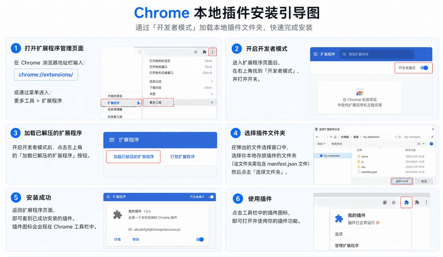

# 豆豆 - 日常工具箱

一款集日常提效与开发辅助于一体的 Chrome 扩展工具箱。

- 🤖 **AI 智能体平台**：智能体管理与应用
- ♾️ **AI 画布**：自由创作，无限可能
- 🔌 **API 调试**：接口请求、响应调试
- 📸 **页面截图**：整页截图或区域选择截图
- 🔓 **CORS Unblock**：解除跨域限制
- 🔳 **生成二维码**：生成当前页面的二维码
- 🍪 **导出 Cookies**：下载当前页面 Cookies
- 🎯 **页面转 MD**：选取元素下载 Markdown

## 安装

### 安装步骤

1. 下载或克隆本仓库到本地。
2. 打开 Chrome 浏览器，进入扩展程序管理页。
3. 开启「开发者模式」。
4. 点击「加载已解压的扩展程序」。
5. 选择豆豆项目目录完成安装。
6. 安装完成后，在浏览器扩展栏固定豆豆图标即可开始使用。

---

## 社区与交流

| 公众号                                       | QQ群（1095058701）                            |
| -------------------------------------------- | --------------------------------------------- |
|  |  |
